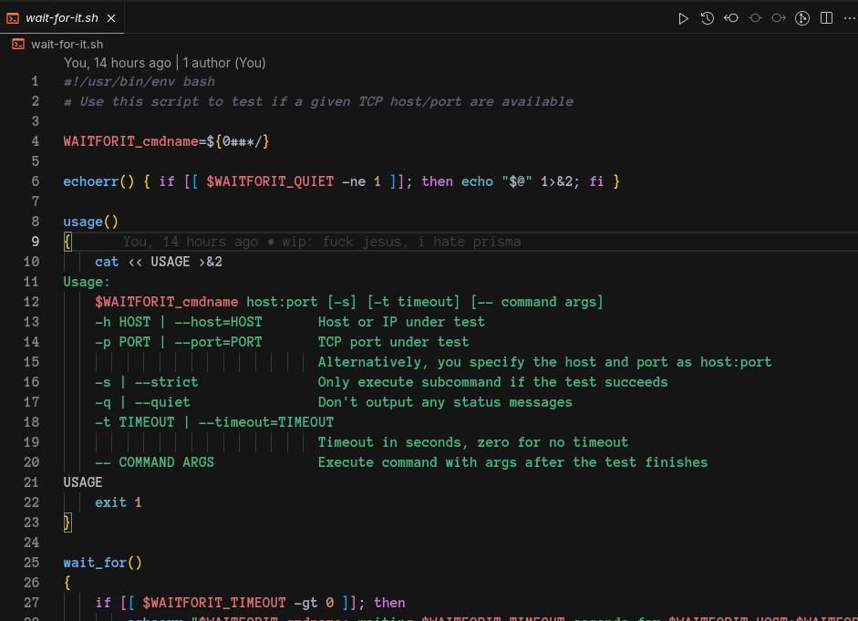
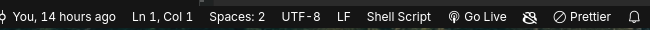
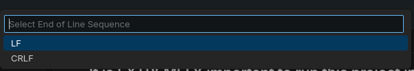

# AquaGas Monitor

## Table of Contents

- [Overview](#overview)
- [Overview For Windows](#overview-for-windows)
- [Installation](#installation)

## Overview

The back-end of a service that manages individual readings for water and gas consumption will leverage AI to obtain measurements from photos of meters. This approach will facilitate the accurate collection of data by utilizing advanced image recognition technology to interpret the meter readings.

## Overview For Windows

> <h3>It is EXTREMELY important to run this project in a Linux environment. If you are using Windows, please follow the steps below.</h3>

1. Open your `wait-for-it.sh`
  

2. Select the type of your file (in windows should be `CRLF`)


3. Change to `LF`, save file, and follow the below instructions


<hr>

api-doc: https://www.postman.com/science-geoscientist-88101143/workspace/aquagas-doc/collection/37958244-aafa432e-6bb4-4df2-9696-b8075ce9e8d8?action=share&creator=37958244&active-environment=37958244-9d9a5ea5-b99e-46f5-8e4f-99dbc859def9

## Installation

1. Clone the repository:

   ```bash
    git clone git@github.com:voibhiv/aquagas-monitor.git
   ```

2. Navigate to the project directory:

   ```bash
    cd aquagas-monitor
   ```

3. Create an .env file and add your secret key:

   ```bash
    GEMINI_API_KEY='your-secret-key'
   ```

   <b>voce pode conseguir uma secret-key aqui:</b> https://ai.google.dev/gemini-api/docs/api-key

4. Run the containers using Docker:
   ```bash
    docker compose up --build
   ```
